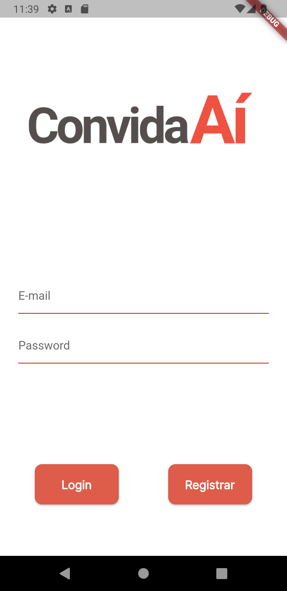
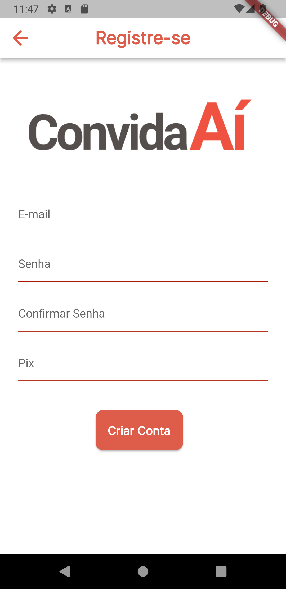
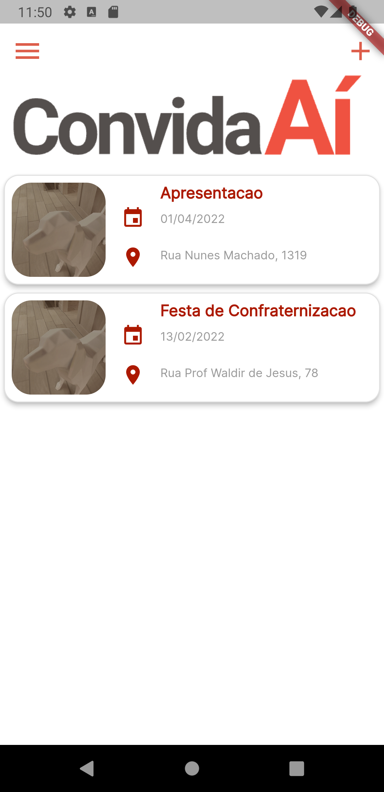
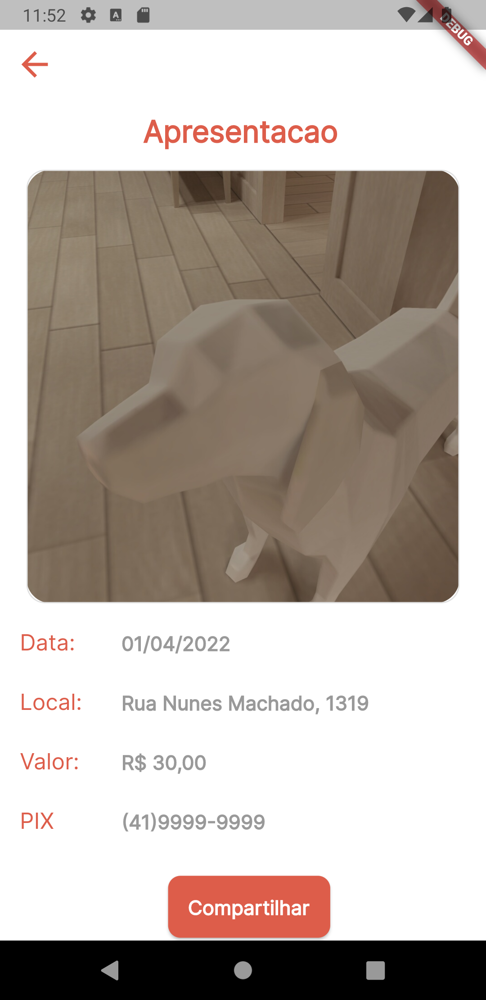
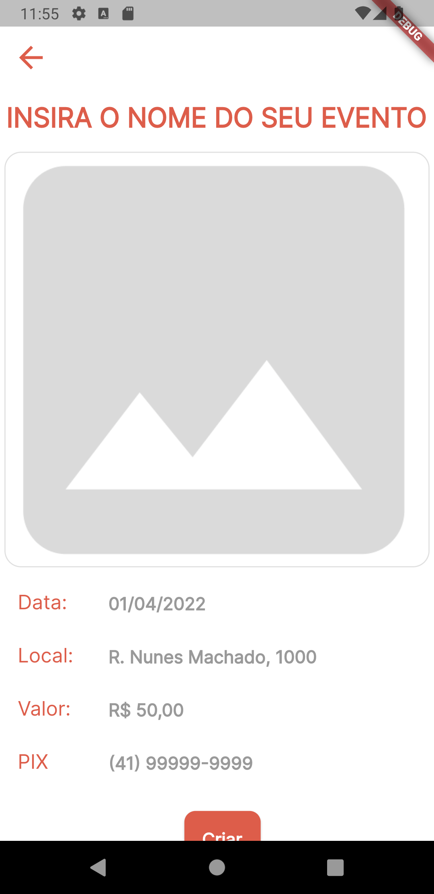
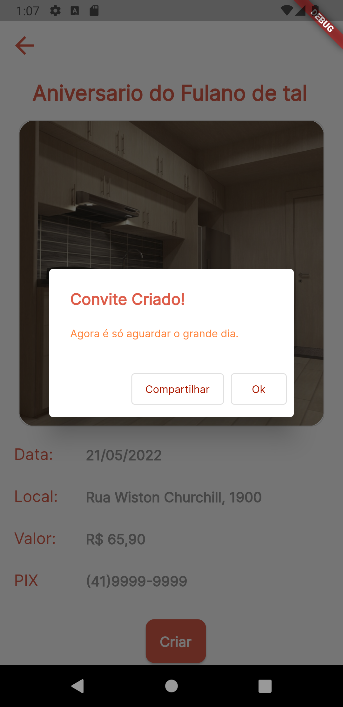

# convida_ai_1

This project was proposed on a training course organized by Snowman Labs. Its main purpose is to allow users to create and share their events on their group on WhatsApp, Facebook or any other platform.

You need to login on our app, to do it you need to register first, and then use it to login. The login and registration screen are illustrated bellow.




When you are redirected to our home page, you can see a list of events that you created. And then when you tap on one of them, you will see a page with further information. It is illustrated on the images bellow.




If you want to create an event, you need to tap the top right 'Add' symbol, and a new screen is shown as illustrated bellow.



When fill your event`s information and then tap 'Criar', a dialog is shown informing that you have created an event and then a share button appears. It is illustrated in the image bellow.



## Getting Started

If you would like to collaborate or just run this app on your computer, remember that you need to have this items on your Desktop:

- Dart
- Flutter
- Visual Studio Code
- Android Studio
- XCode (MacOS)

And then you need to run the following command in your terminal:

```
git clone https://github.com/wilsleygermano/ConvidaAI.git
```